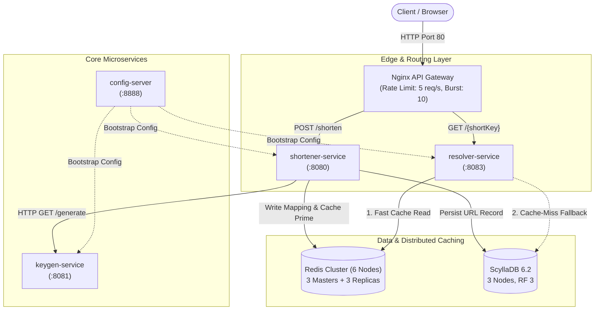
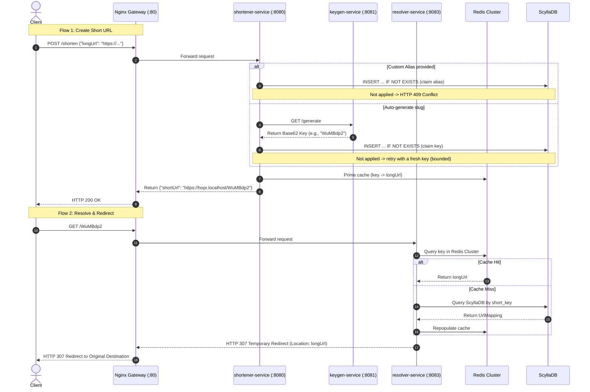

# Hopr — High-Performance Distributed URL Shortener & Resolver

[](https://openjdk.org/)
[](https://spring.io/projects/spring-boot)
[-blue.svg?style=flat-square)](https://spring.io/projects/spring-cloud)
[](https://gradle.org/)
[](https://www.docker.com/)
[](https://kubernetes.io/)
[](https://redis.io/)
[](https://www.scylladb.com/)
[](https://www.eclemma.org/jacoco/)
[](LICENSE)

**Hopr** is a cloud-native, production-grade distributed URL shortening and resolution platform engineered for ultra-high throughput, low-latency redirect resolution, and horizontal scalability.

Designed with clean architecture and domain-driven principles, Hopr eliminates common database bottlenecks using **distributed 64-bit Snowflake ID generation**, **Base62 URL-safe encoding**, a **6-node Redis Cluster** multi-tier caching layer, and an **Nginx Edge API Gateway** with native C-level rate limiting.

---

## Table of Contents

- [Architectural Highlights](#architectural-highlights)
- [System Architecture](#system-architecture)
  - [High-Level Topology](#high-level-topology)
  - [Request Flow: Shorten & Resolve](#request-flow-shorten--resolve)
- [Microservices Overview](#microservices-overview)
- [Technology Stack](#technology-stack)
- [Getting Started](#getting-started)
  - [Prerequisites](#prerequisites)
  - [Local Setup via Docker Compose](#local-setup-via-docker-compose)
  - [Kubernetes & Helm Deployment](#kubernetes--helm-deployment)
- [API Reference & Testing Guide](#api-reference--testing-guide)
  - [1. Shorten a URL (Auto-Generated Key)](#1-shorten-a-url-auto-generated-key)
  - [2. Shorten a URL with Custom Alias](#2-shorten-a-url-with-custom-alias)
  - [3. Shorten a URL with an Expiration](#3-shorten-a-url-with-an-expiration)
  - [4. Resolve & Redirect (GET /{shortKey})](#4-resolve--redirect-get-shortkey)
  - [5. Verify Edge Rate Limiting](#5-verify-edge-rate-limiting)
  - [6. Interactive Swagger / OpenAPI UI](#6-interactive-swagger--openapi-ui)
- [Frontend](#frontend)
- [TLS (Transport Security)](#tls-transport-security)
- [Quality Assurance & CI](#quality-assurance--ci)
- [Architecture Decision Records (ADRs)](#architecture-decision-records-adrs)
- [Project Directory Layout](#project-directory-layout)
- [Configuration Reference](#configuration-reference)
- [License](#license)

---

## Architectural Highlights

- **Decentralized, Collision-Free Key Generation**: Uses a 64-bit Twitter Snowflake algorithm (timestamp + worker ID + sequence) coupled with Base62 encoding. Generates 7-character URL-safe slugs without database auto-increment locks or central coordination overhead.
- **Sub-Millisecond Median Read Latency**: Read operations bypass database lookups via an in-memory Caffeine local cache backed by a distributed **6-node Redis Cluster** (3 masters + 3 replicas). A 3-node **ScyllaDB** cluster (RF 3) acts as durable cold storage. Measured with `scripts/load-test-resolver.sh` (k6, 20 concurrent VUs, warm cache, single-instance Compose stack) against a resolver-service Docker Compose deployment: p50 ≈ 409µs, p95 ≈ 886µs, **p99 ≈ 1.66ms** — the median and p95 are sub-millisecond, but the tail (p99) is not; see the load test script and `resolver-service/loadtest/` for how to reproduce and for how these numbers change under a different load level or environment.
- **Lightweight Edge API Gateway**: Powered by Nginx on port `80`, handling North-South routing, CORS preflight (`OPTIONS`), and socket-level token bucket rate limiting (5 req/s, burst 10) with negligible memory footprint (~20MB RAM) and zero GC pauses.
- **Cloud-Native Service Discovery**: Eliminates heavyweight JVM service registries (Netflix Eureka) in favor of container platform discovery (Docker Compose internal DNS and Kubernetes CoreDNS/kube-proxy).
- **Centralized Spring Cloud Config Server**: Native repository-backed configuration server delivering environment-agnostic properties to all downstream microservices at startup.
- **Strict Quality Enforcement**: Enforced build-time JaCoCo verification rule requiring a minimum of **85% line coverage** across modules.
- **Modern Java & Spring Ecosystem**: Upgraded to **Java 25** (OpenJDK Temurin), **Spring Boot 4.1.1**, **Spring Cloud 2025.1.2 (Oakwood)**, and **Gradle 9.4.1 (Kotlin DSL)**.

---

## System Architecture

### High-Level Topology



### Request Flow: Shorten & Resolve



---

## Microservices Overview

| Service | Technology | Port | Description |
| :--- | :--- | :--- | :--- |
| **`api-gateway`** | Nginx | `443` (`80` redirects) | TLS termination, edge reverse proxy, CORS preflight handler, and C-level rate limiter (5 req/s, burst 10). |
| **`shortener-service`** | Spring Boot 4 / Java 25 | `8080` | URL shortening engine, alias validation, Redis cache priming, and ScyllaDB persistence. |
| **`resolver-service`** | Spring Boot 4 / Java 25 | `8083` | High-performance resolution engine returning `HTTP 307 Temporary Redirect` via Redis Cluster & ScyllaDB. |
| **`keygen-service`** | Spring Boot 4 / Java 25 | `8081` | Dedicated worker generating 64-bit Snowflake IDs encoded into Base62 URL slugs. |
| **`config-server`** | Spring Cloud Config | `8888` | Centralized external configuration repository for all microservices. |
| **`common`** | Java Library (JAR) | — | Shared domain entities (`UrlMapping`), DTOs, and exception models. |
| **`db-migration`** | Flyway / CQL | — | Versioned ScyllaDB schema migrations — see `db-migration/README.md`. |
| **`scylla-node-1` .. `3`** | ScyllaDB 6.2 | `9042-9044` | 3-node wide-column cluster (keyspace `hopr`, RF 3) — the persistence store behind `shortener-service` and `resolver-service`. |
| **`redis-cluster`** | Redis 7.x (6 Nodes) | `7001-7006` | Distributed, sharded cache layer (3 master nodes, 3 replica nodes). |

---

## Technology Stack

| Layer | Component | Details |
| :--- | :--- | :--- |
| **Runtime & Language** | Java | **OpenJDK 25** (via Eclipse Temurin toolchain) |
| **Framework** | Spring Ecosystem | **Spring Boot 4.1.1**, **Spring Cloud 2025.1.2 (Oakwood)** |
| **Build & Tooling** | Gradle | **Gradle 9.4.1** (Kotlin DSL multi-module build) |
| **Edge Gateway** | Nginx | **Nginx Alpine**, non-blocking event-loop (`epoll`), `limit_req_zone` |
| **Distributed Caching** | Redis | **6-node Redis Cluster** (sharded, master-replica replication) |
| **Local In-Memory Cache** | Caffeine | In-process cache for ultra-hot path resolution |
| **Persistence** | ScyllaDB | **ScyllaDB 6.2**, 3 nodes at RF 3, schema managed by Flyway CQL migrations |
| **Key Generation Algorithm** | Snowflake + Base62 | 64-bit timestamp + worker ID + sequence with Base62 character mapping |
| **API Documentation** | OpenAPI 3 | **springdoc-openapi 3.1.0** (Swagger UI on `/swagger-ui.html`) |
| **Code Coverage** | JaCoCo | Enforced build verification (Bundle line coverage $\ge 85\%$) |
| **Orchestration** | Docker / Kubernetes | Docker Compose V2, Kubernetes Helm Chart (`kind`) |

---

## Getting Started

### Prerequisites

- **Java 25** (or compatible JDK) installed locally.
- **Docker & Docker Compose** (Docker Desktop on macOS/Windows, or Docker Engine V2 on Linux).
- **cURL** or any REST API client (Postman, Bruno, HTTPie).
- *(Optional for k8s)*: `kind`, `kubectl`, and `helm`.

---

### Local Setup via Docker Compose

The simplest way to run the entire distributed environment locally:

#### Step 1: Clone and Build Application JARs

Dockerfiles copy compiled JARs from each service's `build/libs/`. Compile and package all services:

```bash
git clone https://github.com/pcaokhai/Hopr.git
cd Hopr

# Environment files are gitignored; create them from the committed templates.
# .env holds non-secret config, .env.secrets holds credentials - the same split the
# Helm chart makes between the hopr-config ConfigMap and the hopr-secret Secret.
cp .env.example .env
cp .env.secrets.example .env.secrets

# Mint the self-signed certificate the gateway serves HTTPS with. Certificates and private
# keys are never committed, so every clone generates its own. See "TLS" below.
./api-gateway/generate-dev-cert.sh

# Build executable JARs (skip unit tests for fast build)
./gradlew bootJar -x test
```

#### Step 2: Start ScyllaDB & Apply the Schema

`shortener-service` and `resolver-service` connect to the `hopr` keyspace at boot, so the
schema must exist before they start:

```bash
docker compose up -d scylla-node-1 scylla-node-2 scylla-node-3
./gradlew :db-migration:migrateScylla
```

#### Step 3: Launch the Rest of the Infrastructure & Microservices

```bash
docker compose up -d --build
```

This command will:
1. Reuse the already-running **3-node ScyllaDB** cluster.
2. Spin up **6 Redis nodes** and execute the one-shot `redis-cluster-init` container to form the cluster.
3. Start the **Config Server** and wait for it to be ready.
4. Launch **`keygen-service`**, **`shortener-service`**, and **`resolver-service`**.
5. Launch the **`api-gateway`** reverse proxy on ports `443` (HTTPS) and `80` (redirect only).

#### Step 4: Verify Container Health

Check that all containers are healthy and running:

```bash
docker compose ps
```

*Note: `hopr-redis-cluster-init` with status `Exited (0)` is expected after successful cluster configuration.*

---

### Kubernetes & Helm Deployment

Hopr includes a first-party Helm chart and automated scripts to launch on a local **`kind`** (Kubernetes-in-Docker) cluster with native **`ingress-nginx`**:

```bash
cd k8s

# Build Docker images and load them directly into the kind cluster
./build-and-load.sh

# Spin up kind cluster, deploy Redis cluster via Helm, and deploy hopr-chart
./deploy.sh
```

For in-depth Kubernetes documentation, values overrides, and cluster architecture, refer to [`k8s/README.md`](k8s/README.md).

---

## API Reference & Testing Guide

All client requests enter through the Nginx Edge Gateway at `https://hopr.localhost/` over
HTTPS. Plain `http://` is answered with a `301` to the same path on `https://hopr.localhost`
(the gateway's primary name, so `http://localhost/x` lands on `https://hopr.localhost/x`) and
serves nothing itself. The gateway's certificate is **self-signed** in local development, so every `curl`
below passes `-k` and a browser will show a warning you have to click through — see
[TLS](#tls-transport-security) for why, and for what a real deployment does instead.

### 1. Shorten a URL (Auto-Generated Key)

> 🔑 **Authentication**: `POST /shorten` requires an `X-API-Key` header; a request without a valid
> key is rejected with `HTTP 401 Unauthorized` and a `{"status": 401, "message": "..."}` body. The
> local development key is `hopr-local-dev-key`, whose SHA-256 digest ships in `.env.example` as
> `SHORTENER_API_KEY_HASHES` — the service only ever stores digests, never the keys themselves. To
> mint your own: `KEY=$(openssl rand -hex 32); printf %s "$KEY" | shasum -a 256`, then put the digest
> in `SHORTENER_API_KEY_HASHES` (comma-separate several) and hand `$KEY` to the client.
>
> Redirects (`GET /{shortKey}`) stay public and need no key — a short link only works if anyone
> holding it can follow it.

> ⚠️ **Notice**: Request payload must contain the key `longUrl`. It must be an absolute `http`/`https`
> URL (scheme is case-insensitive), at most 2048 characters, and parseable as a URI — anything else is
> rejected with `HTTP 400 Bad Request` and a `{"status": 400, "message": "..."}` body listing the
> violations.

```bash
curl -vk -X POST https://hopr.localhost/shorten \
  -H "X-API-Key: hopr-local-dev-key" \
  -H "Content-Type: application/json" \
  -d '{"longUrl": "https://github.com/pcaokhai/Hopr"}'
```

**Response (HTTP 200 OK):**
```json
{
  "shortUrl": "https://hopr.localhost/8zK1x9P"
}
```

---

### 2. Shorten a URL with Custom Alias

```bash
curl -vk -X POST https://hopr.localhost/shorten \
  -H "X-API-Key: hopr-local-dev-key" \
  -H "Content-Type: application/json" \
  -d '{
    "longUrl": "https://spring.io",
    "alias": "spring-home"
  }'
```

**Response (HTTP 200 OK):**
```json
{
  "shortUrl": "https://hopr.localhost/spring-home"
}
```

*If the alias already exists, the service responds with `HTTP 409 Conflict`.*

---

### 3. Shorten a URL with an Expiration

Pass `expiresInSeconds` to make the short link expire on its own — the row is written to
ScyllaDB with a native per-row TTL, so the database physically drops it once the time elapses
(no application cleanup job involved). Once expired, the link 404s on resolve. Omitting the
field keeps the pre-existing behavior of a link that never expires.

```bash
curl -vk -X POST https://hopr.localhost/shorten \
  -H "X-API-Key: hopr-local-dev-key" \
  -H "Content-Type: application/json" \
  -d '{
    "longUrl": "https://example.com/flash-sale",
    "expiresInSeconds": 3600
  }'
```

**Response (HTTP 200 OK):**
```json
{
  "shortUrl": "https://hopr.localhost/9fQ2mZa"
}
```

---

### 4. Resolve & Redirect (GET /{shortKey})

Use the generated key or alias:

```bash
curl -vk https://hopr.localhost/spring-home
```

**Response:**
```http
< HTTP/1.1 307 Temporary Redirect
< Server: nginx
< Location: https://spring.io
< Content-Length: 0
```

*Or paste `https://hopr.localhost/spring-home` directly into your web browser to verify automatic redirection.*

---

### 5. Verify Edge Rate Limiting

The API Gateway enforces rate limiting of **5 requests/second with a burst of 10**. Test the threshold using a bash loop:

```bash
for i in {1..15}; do
  curl -sk -o /dev/null -w "Request $i: HTTP %{http_code}\n" \
    -X POST https://hopr.localhost/shorten \
    -H "X-API-Key: hopr-local-dev-key" \
    -H "Content-Type: application/json" \
    -d '{"longUrl": "https://example.com"}'
done
```

**Expected Result:** First 10–11 requests succeed (`200 OK`), after which subsequent requests are immediately rejected by Nginx with `429 Too Many Requests`.

---

### 6. Interactive Swagger / OpenAPI UI

When running locally, explore and test individual microservice APIs via Swagger UI:

- **Shortener Service Swagger**: [http://localhost:8080/swagger-ui.html](http://localhost:8080/swagger-ui.html)
- **Resolver Service Swagger**: [http://localhost:8083/swagger-ui.html](http://localhost:8083/swagger-ui.html)

---

## Frontend

A Next.js + TypeScript + Tailwind + shadcn/ui frontend lives in `frontend/`.
It wires the landing-page shorten form to the real `/shorten` API; the
dashboard and analytics screens use mock data — the backend now exposes
`/links` list/update/delete endpoints, but the dashboard isn't wired to them
yet, and there is still no analytics or auth endpoint. See `frontend/README.md`
for how to run it and what's real vs. mocked. Under Docker Compose and in the Helm chart it runs as its own
container behind the gateway (`https://hopr.localhost/`), which is what applies
the per-client rate limit to its server-side `/api/shorten` route.

---

## TLS (Transport Security)

### What the gateway does

The Nginx gateway is the **TLS termination point**: it is the only component that holds the
certificate and its private key. It accepts HTTPS on `443`, decrypts the request, and forwards
it as plain HTTP to `shortener-service`, `resolver-service` or `frontend` over the private
Docker/Kubernetes network. Port `80` holds no routes at all — it answers every path with a
`301` to the `https://` URL, so nothing (including the `X-API-Key` header on `POST /shorten`)
can travel in cleartext to a service.

Terminating at the edge and proxying plaintext inward is the normal pattern, not a hole. The
plaintext hop never crosses an untrusted network — it stays inside one container network /
cluster — and centralizing the key means one component to rotate, patch and audit instead of
five. (When that internal network *is* untrusted — multi-tenant clusters, traffic crossing
availability zones — you add mutual TLS between services on top, which is a separate concern
from edge termination.)

The HTTPS server also sets the headers that only make sense over TLS:

| Header | Purpose |
| :--- | :--- |
| `Strict-Transport-Security: max-age=300; includeSubDomains` | Tells the browser never to try `http://` for this host again, closing the one-request window the `301` leaves open. The `max-age` is deliberately short here: this gateway answers for `localhost`, and the standard one-year pin would apply to every other plain-HTTP project on your machine, clearable only via `chrome://net-internals/#hsts`. A real deployment on a real domain raises it to `31536000` (one year) once TLS is proven stable. |
| `X-Content-Type-Options: nosniff` | Stops the browser from guessing a content type. |
| `X-Frame-Options: DENY` | Blocks framing / clickjacking. |
| `Referrer-Policy: strict-origin-when-cross-origin` | Keeps short-link paths out of third-party referrers. |

### The certificate here is self-signed — dev only

`./api-gateway/generate-dev-cert.sh` mints a self-signed certificate into
`api-gateway/certs/` (gitignored; `k8s/deploy.sh` mints an equivalent pair for the cluster and
feeds it to the `hopr-tls` Secret). Self-signed means the certificate vouches for itself:
no certificate authority any browser or client trusts has signed it. So clients refuse it
until you override:

```bash
curl -k https://hopr.localhost/         # -k = "don't verify the chain"
```

In a browser: "Advanced" → "Proceed to hopr.localhost (unsafe)".

That is fine for a learning/local deployment — the traffic is still encrypted, and you are
the only party involved. It is **never acceptable for a real public deployment**: a user
cannot tell your self-signed certificate from an attacker's, so training them to click
through the warning destroys the only signal that would flag a real machine-in-the-middle.
"Encrypted" and "authenticated as the right server" are two separate guarantees, and a
self-signed certificate only gives you the first.

### Future concept: a real certificate via cert-manager + Let's Encrypt

Not built here — this project has no registered domain to issue a certificate for. When it
does, the change is small, because the `hopr-tls` Secret the controller already serves is
exactly what cert-manager produces:

1. Install cert-manager and create a `ClusterIssuer` for Let's Encrypt (ACME) using the
   HTTP-01 challenge, which the existing ingress-nginx controller already serves.
2. Give the Ingress a real host rule (`host: hopr.example.com`) plus its own `tls:` block
   listing that host, and the `cert-manager.io/cluster-issuer: letsencrypt-prod` annotation.
3. Delete the self-signed generation from `k8s/deploy.sh` and the `tls.crt`/`tls.key` values
   — cert-manager creates and renews `hopr-tls` itself, every 60 days, with no human step.
4. Point DNS at the ingress, so Let's Encrypt can reach the challenge and prove you control
   the domain — the step a self-signed certificate skips, and the whole reason clients trust
   the result.

Today the Ingresses are host-less, so the controller serves them from its catch-all server and
takes the certificate from its `--default-ssl-certificate=hopr/hopr-tls` flag (set by
`k8s/deploy.sh`) — no Ingress `tls:` block is consulted, which is why none is written. Adding a
real host is what makes a per-Ingress `tls:` block the operative reference; the Secret name
stays `hopr-tls`.

---

## Quality Assurance & CI

Hopr adheres to strict testing and code coverage standards.

### Running Test Suites

Execute all unit and integration tests across the multi-project workspace:

```bash
./gradlew test
```

### JaCoCo Code Coverage Verification

Build-time validation ensures that business logic meets the **85% line coverage** requirement:

```bash
# Verify coverage thresholds
./gradlew jacocoTestCoverageVerification

# Generate unified HTML coverage reports
./gradlew jacocoTestReport
```

HTML reports will be generated in `*/build/reports/jacoco/test/html/index.html` for each service.

### GitHub Actions CI

Automated CI workflows (`.github/workflows/gradle-build-main.yml`) run on every push and pull request against the `main` branch, compiling with JDK 25 and executing test verification.

---

## Architecture Decision Records (ADRs)

Key architectural decisions are documented to preserve design rationale:

- **[ADR 0001: Nginx as Edge API Gateway and Service Discovery Mechanics Under Scaling](docs/ADR/0001-api-gateway-selection-and-service-discovery.md)**
  - *Rationale*: Chooses Nginx over JVM-based Spring Cloud Gateway to achieve ultra-low memory footprint (~20MB vs ~500MB), zero GC pause latency, and native socket-level rate limiting.
- **[ADR 0002: Removal of Eureka, Adoption of Spring Cloud Config Server & Native Platform Discovery](docs/ADR/0002-remove-eureka-config-server-k8s-ingress.md)**
  - *Rationale*: Eliminates Netflix Eureka in favor of native platform discovery (Docker Compose internal DNS, Swarm VIPs, Kubernetes CoreDNS/kube-proxy), introduces Spring Cloud Config Server for externalized configuration, and leverages native Kubernetes Ingress.

---

## Project Directory Layout

```
Hopr/
├── .github/workflows/         # GitHub Actions CI pipelines (Java 25)
├── api-gateway/               # Nginx config (TLS termination, routing, rate limit, CORS)
│                              # + generate-dev-cert.sh for the self-signed dev cert
│   └── nginx.conf
├── common/                    # Shared library (domain models, DTOs)
├── config-server/             # Spring Cloud Config Server (native repo)
│   └── src/main/resources/config-repo/  # Centralized YAML configurations
├── keygen-service/            # Snowflake ID + Base62 key generator service
├── shortener-service/         # URL shortening & persistence service
├── resolver-service/          # Fast resolution & HTTP 307 redirect service
├── docs/                      # Architectural Decision Records (ADR) & docs
│   └── ADR/
├── k8s/                       # Kubernetes manifests, kind config & Helm chart
│   ├── hopr-chart/            # First-party Helm chart
│   ├── deploy.sh              # Local k8s automated deployment script
│   └── README.md
├── docker-compose.yml         # Local multi-container Docker Compose definition
├── build.gradle.kts           # Multi-project root Gradle build (Kotlin DSL)
├── settings.gradle.kts        # Gradle module declarations
├── .env.example               # Template for .env (non-secret local config; gitignored copy)
├── .env.secrets.example       # Template for .env.secrets (credentials; gitignored copy)
├── .env.frontend.secrets.example  # Template for the frontend container's own credential file
└── README.md
```

---

## Configuration Reference

`.env.example`, `.env.secrets.example` and `.env.frontend.secrets.example` are the authoritative list of variables and their
defaults; copy them as shown above. The ones worth explaining:

| Variable | File | Description |
| :--- | :--- | :--- |
| `SCYLLA_CONTACT_POINTS` | `.env` | Comma-separated CQL contact points |
| `SCYLLA_KEYSPACE` | `.env` | Keyspace created by `db-migration` |
| `SCYLLA_DATACENTER` | `.env` | Driver's local datacenter, required for request routing |
| `REDIS_NODE_1` ... `REDIS_NODE_6` | `.env` | Hostnames and ports for the 6 Redis Cluster nodes |
| `SHORTENER_DOMAIN` | `.env` | Base domain prepended to generated short URLs |
| `SHORTENER_API_KEY_HASHES` | `.env` | Comma-separated SHA-256 digests of the API keys accepted on `POST /shorten`; digests only, never the keys |
| `REDIS_PASSWORD` | `.env.secrets` | Redis credential; empty locally, set for a deployed Redis |
| `SHORTEN_API_KEY` | `.env.frontend.secrets` | Plaintext key the frontend's server-side `/api/shorten` route presents as `X-API-Key`; its digest must appear in `SHORTENER_API_KEY_HASHES` |

Inter-service endpoints (Config Server, keygen) are not environment variables — they come from
each service's `application.yml` and the Config Server's `config-repo/`.

---

## Teardown & Clean Reset

- **Stop all services (preserve database and cache data):**
  ```bash
  docker compose down
  ```

- **Complete wipe and fresh restart (delete volumes and cached state):**
  ```bash
  docker compose down -v
  rm -rf ./data/scylla-*/* ./data/redis-*/*
  ```

---

## License

This project is licensed under the Apache License 2.0. See the [LICENSE](LICENSE) file for details.
